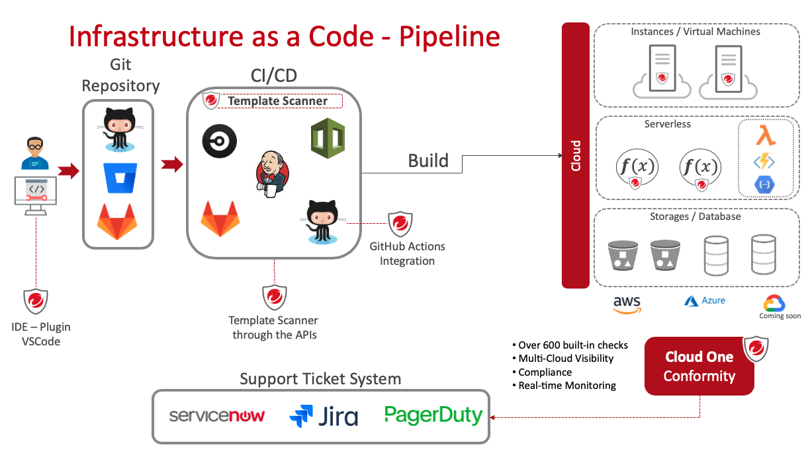

# Example of Infrastructure-as-a-Code Security Automation with Cloud One - Conformity Template Scanner

## VSCode Plugin for Cloud One - Conformity (by Raphael Bottino)
- https://marketplace.visualstudio.com/items?itemName=raphaelbottino.cc-template-scanner

## Gitlab CI file Example for Template Scanner for CloudFormation Templates (gitlab-ci-example.yml)

Using the template scanner from Will Robison (https://github.com/OzNetNerd/Cloud-Conformity-Pipeline-Scanner)

Variable Configuration Needed:

- AWS_ACCESS_KEY_ID
- AWS_DEFAULT_REGION
- AWS_SECRET_ACCESS_KEY
- CC_API_KEY
- CC_REGION
- CC_RISK_LEVEL
- CFN_TEMPLATE_FILE_LOCATION

## GitHub Actions by (Felipe Costa and Raphael Bottino)

- https://github.com/marketplace/actions/cloud-one-conformity-pipeline-scanner

Variable Configuration Needed:

- cc_apikey (Cloud One Conformity API KEY)
- cc_region (Cloud One Conformity account region)
- templatePath (Path of the template to be scanned)
- maxExtreme | maxVeryHigh | maxHigh | maxMedium | maxLow (Choose one or more of the options and set a number of how many violations are accepted)

PS.: ALWAYS use secrets to expose your credentials!